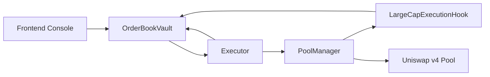
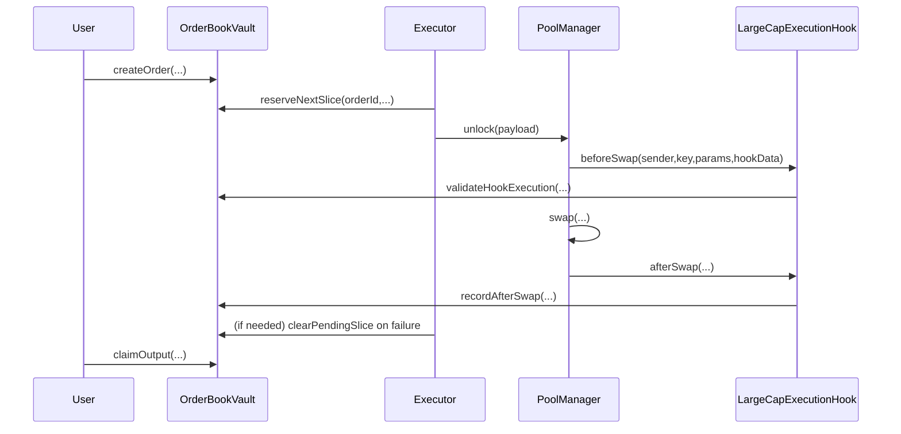
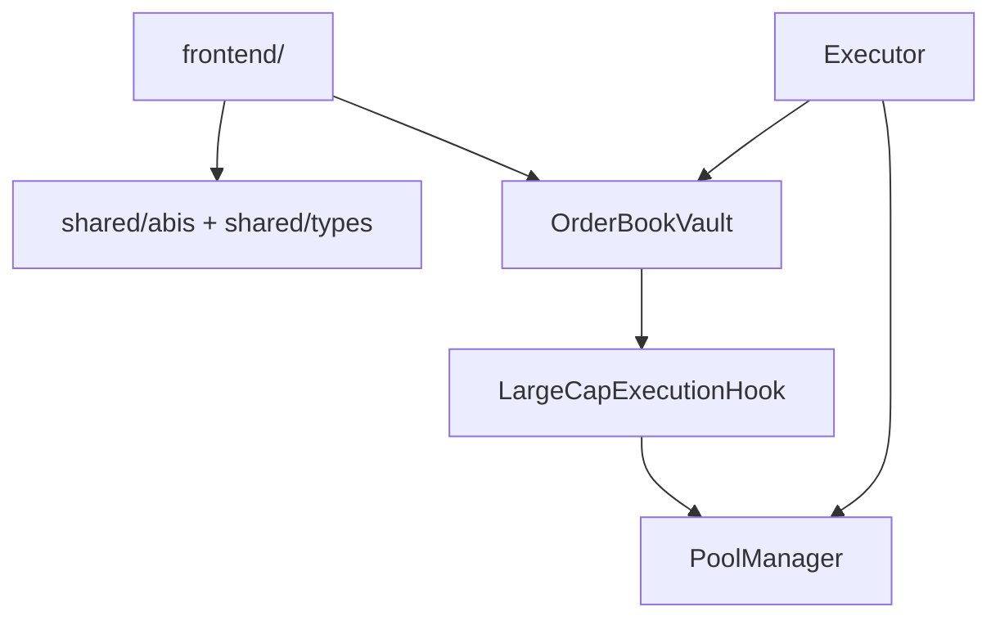

# Large-Cap Execution Hook

<p align="left">
  
  
</p>

A Uniswap v4 hook system for executing large orders as deterministic micro-slices instead of single-shot swaps.

## Problem

Large swaps in concentrated-liquidity pools can suffer:

- High instantaneous price impact.
- Increased MEV extractability.
- Poor execution consistency for integrators and treasury workflows.

## Solution

This repository implements a block-aware segmented execution primitive with three onchain components:

- `OrderBookVault`: order custody + policy enforcement + accounting.
- `LargeCapExecutionHook`: swap-time policy checks through `beforeSwap`/`afterSwap`.
- `Executor`: atomic slice execution through `PoolManager.unlock` callback flow.

Supported modes:

- `BBE` (Block-Based Execution)
- `SOF` (Segmented Order Flow)

## Uniswap v4 Compatibility Notes

- Hook permissions are encoded in hook address bits and validated at deployment.
- Core hook functions implemented: `beforeSwap`, `afterSwap`.
- Hook entrypoints are restricted to `PoolManager` (`BaseHook.onlyPoolManager`).
- Heavy logic is intentionally kept out of the hook and placed in vault/executor.

## Architecture







## Repository Layout

```text
.
├── assets/
├── context/
├── docs/
├── frontend/
├── lib/
├── script/
├── scripts/
├── shared/
├── src/
├── test/
├── foundry.toml
├── remappings.txt
├── Makefile
└── package.json
```

## Quickstart

### 1) Bootstrap dependencies

```bash
make bootstrap
```

This pins Uniswap v4 dependencies, including `v4-periphery` commit:

- `3779387e5d296f39df543d23524b050f89a62917`

### 2) Build and test

```bash
make build
make test
make coverage
```

### 3) Export shared ABIs

```bash
make export-shared
```

## Demo

### Local compare run

```bash
make demo-local
```

Output summary includes:

- total input
- baseline output
- segmented output
- slices executed
- improvement (bps)

### Testnet deployment

```bash
export TESTNET_RPC_URL="..."
export PRIVATE_KEY="..."
make demo-testnet
```

## Frontend

UI console lives in `frontend/` and consumes shared artifacts from `shared/`.

Features:

- order creation
- mode selection
- slice progress monitor
- realized average price vs naive baseline

## Security

See [docs/security.md](./docs/security.md) for threat model, mitigations, and residual risks.

Mainnet deployments should undergo independent audit.

## Assumptions

- The requested pinned commit `3779387` is interpreted as Uniswap `v4-periphery` commit `3779387e5d296f39df543d23524b050f89a62917`.
- `v4-core` is pinned to the commit referenced by that periphery commit.
- Node tooling is not available in this workspace environment, so frontend lockfile generation is stubbed in-repo and should be regenerated with `npm install` in a Node-enabled environment.

## Docs Index

- [Overview](./docs/overview.md)
- [Architecture](./docs/architecture.md)
- [Execution Modes](./docs/execution-modes.md)
- [Security](./docs/security.md)
- [Deployment](./docs/deployment.md)
- [Demo](./docs/demo.md)
- [API](./docs/api.md)
- [Testing](./docs/testing.md)
- [Frontend](./docs/frontend.md)
