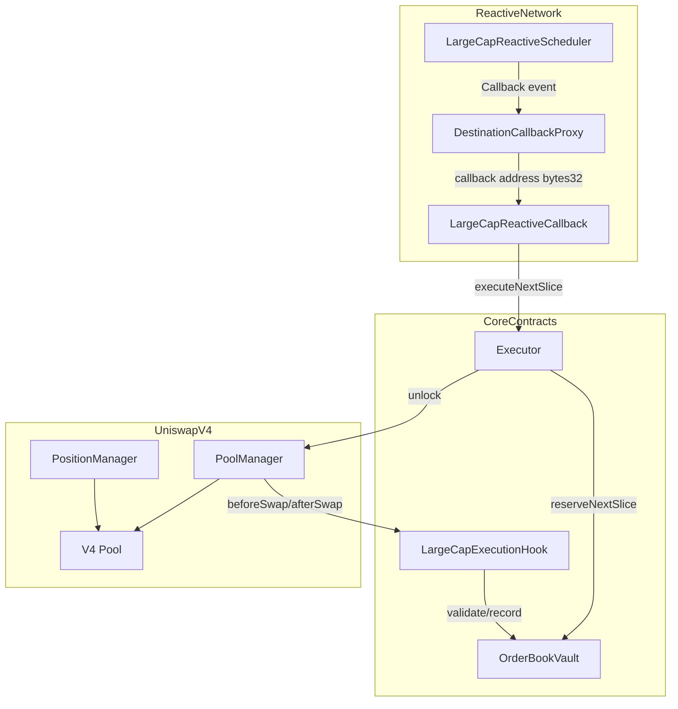
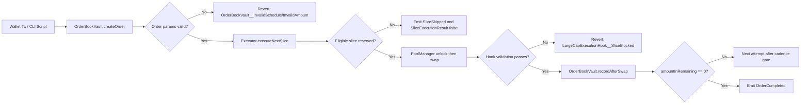
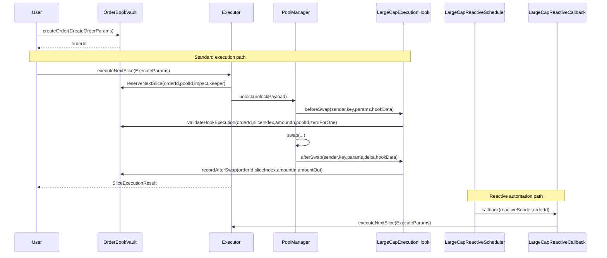
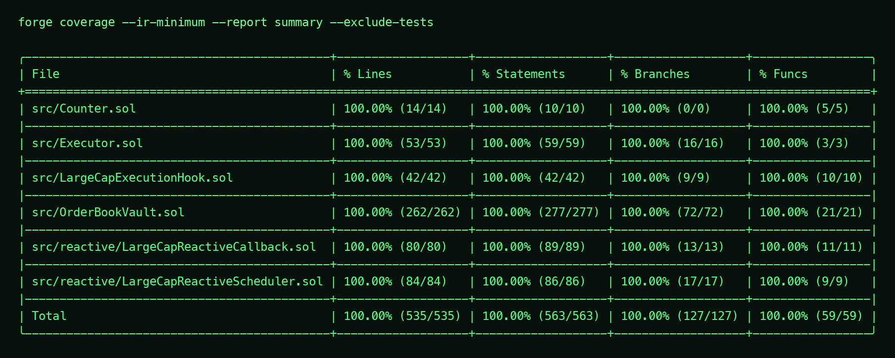

# Large-Cap Execution Hook
**Built on Uniswap v4 × Reactive Network · Deployed on Unichain Sepolia × Reactive Lasna**

_Targeting: Unichain Prize · Reactive Network Prize_

> A Uniswap v4 hook system for executing large orders as deterministic micro-slices instead of single-shot swaps.

     

## The Problem

A treasury execution bot on a concentrated-liquidity AMM routes a single 8-figure sell through one swap call during a volatile market window. The protocol is a Uniswap-style pool, the actor is a large allocator, and the failing mechanism is one-shot exact-input execution against finite active liquidity. The swap walks ticks immediately, leaks intent, and creates deterministic backrun opportunity. Capital impact appears as worse realized execution, larger LP inventory shock, and measurable slippage against quoted price.

The first failure layer is cadence. In v3-style routing and naive v4 routing without policy hooks, execution cadence is externalized to offchain keepers. At EVM level this means no onchain state machine enforces inter-slice block spacing or time intervals per order. If keeper behavior changes or delays, execution quality drifts from intent while users still bear market risk and re-pricing cost.

The second failure layer is pre-trade policy enforcement. Without a policy-aware hook path, there is no enforced check that a pending slice actually matches committed order context at swap-time. The EVM call can still execute if token approvals and router params are valid, even when operational constraints should block. The consequence is fragmented trust: users trust bot discipline instead of contract-level guarantees.

The third failure layer is completion and replay safety. Without pending-slice locks and terminal-state enforcement, repeated executor calls can create ambiguous accounting edges in custom systems. At protocol scale, this compounds as treasury and integrator order flow grows, and each basis point of avoidable slippage translates into material losses when applied to current multi-billion monthly DEX volume.

## The Solution

The core insight is to move execution quality policy from offchain process to an onchain state machine that is checked at hook-time for every slice.

A user creates one parent order in `OrderBookVault`, selecting mode (`BBE` or `SOF`), cadence, impact caps, and per-slice constraints. The executor then calls `executeNextSlice` repeatedly, but each attempt must pass vault policy gates and hook-time validation against the currently pending slice. The system guarantees deterministic progression, explicit reason-coded blocking, and auditable partial-fill accounting without relying on external route orchestration.

At EVM level, the hook is permissioned for swap callbacks only, with hook permissions encoded in the hook address bits and validated by Uniswap v4’s hook-permission model. The cross-contract pattern is `Executor -> OrderBookVault.reserveNextSlice -> PoolManager.unlock -> Executor.unlockCallback -> PoolManager.swap -> LargeCapExecutionHook.beforeSwap/afterSwap -> OrderBookVault.recordAfterSwap`. State is anchored in vault mappings (`s_orders`, `s_pending`, `s_nonces`), and execution guarantees are enforced by `onlyPoolManager` on hook entrypoints, `onlyExecutor` on reservation/clear flows, and `onlyHook` on final accounting writes.

INVARIANT: `amountInRemaining` never underflows and never exceeds configured total — verified by `OrderBookVault.recordAfterSwap(bytes32,uint64,uint128,uint128)`.
INVARIANT: a completed order cannot become active again — verified by `OrderBookVault._previewNextSlice(bytes32,bytes32,uint24,address)`.
INVARIANT: each successful slice is recorded exactly once for a matching pending tuple — verified by `OrderBookVault.validateHookExecution(bytes32,uint64,uint128,bytes32,bool)` and `OrderBookVault.recordAfterSwap(bytes32,uint64,uint128,uint128)`.

## Architecture

### Component Overview

```text
LargeCap System
├── OrderBookVault
│   └── Owns order storage, pending-slice locks, custody, and settlement accounting.
├── LargeCapExecutionHook
│   └── Enforces swap-time policy via beforeSwap/afterSwap and emits telemetry.
├── Executor
│   └── Reserves eligible slices, executes PoolManager unlock flow, settles deltas.
├── LargeCapReactiveCallback
│   └── Authenticated destination callback that triggers executeNextSlice.
└── LargeCapReactiveScheduler
    └── Subscribes to hook logs on origin chain and emits Reactive callback jobs.
```

### Architecture Flow (Subgraphs)



### User Perspective Flow



### Interaction Sequence



## Core Contracts & Components

### `OrderBookVault`

`OrderBookVault` exists as the system-of-record for segmented orders. It separates storage and policy from hook execution to keep hook code minimal and to centralize trust-sensitive accounting transitions.

Critical public entrypoints include `function createOrder(CreateOrderParams calldata params) external returns (bytes32 orderId)`, `function cancelOrder(bytes32 orderId) external`, `function claimOutput(bytes32 orderId, uint128 amount, address recipient) external returns (uint128 claimed)`, `function withdrawRemainingInput(bytes32 orderId, address recipient) external returns (uint128 amount)`, `function reserveNextSlice(bytes32 orderId, bytes32 poolId, uint24 observedImpactBps, address keeper) external returns (SlicePreview memory preview)`, and `function recordAfterSwap(bytes32 orderId, uint64 sliceIndex, uint128 amountIn, uint128 amountOut) external returns (bool completed, uint160 avgPriceX96)`.

Storage ownership is explicit: `mapping(bytes32 => OrderState) s_orders`, `mapping(bytes32 => PendingSlice) s_pending`, `mapping(address => uint64) s_nonces`, plus mutable integration pointers `hook` and `executor`. This model allows deterministic reconciliation between reserved input, realized output, and terminal status transitions.

Trust boundaries are role-gated. `reserveNextSlice` and `clearPendingSlice` are `onlyExecutor`; `recordAfterSwap` is `onlyHook`; hook/executor wiring is owner-controlled through `setHook` and `setExecutor`. Unauthorized calls hit custom errors such as `OrderBookVault__NotExecutor` and `OrderBookVault__NotHook`, preventing state mutation.

In call stack terms, vault sits between user intent and pool execution: it is called upstream by users/keepers for order lifecycle and called downstream by hook/executor during swap-time verification and accounting finalization.

### `LargeCapExecutionHook`

`LargeCapExecutionHook` is a swap-time policy guard and telemetry emitter. It exists as a dedicated module because Uniswap v4 hook entrypoints must remain predictable and low-complexity while still enforcing safety constraints during the exact swap call path.

Critical exposed functions include `function beforeSwap(address sender, PoolKey calldata key, SwapParams calldata params, bytes calldata hookData) external returns (bytes4, BeforeSwapDelta, uint24)`, `function afterSwap(address sender, PoolKey calldata key, SwapParams calldata params, BalanceDelta delta, bytes calldata hookData) external returns (bytes4, int128)`, and telemetry relays `function notifyOrderCreated(bytes32 orderId, address owner, bytes32 poolId, ExecutionMode mode) external`, `function notifyOrderCancelled(bytes32 orderId, address owner) external`, `function notifyOrderCompleted(bytes32 orderId, uint128 totalIn, uint128 totalOut, uint160 avgPriceX96) external`, `function reportSliceBlocked(bytes32 orderId, uint64 sliceIndex, ReasonCode reasonCode) external`.

The hook owns one immutable pointer, `IOrderBookVault public immutable vault`, and no mutable order accounting state. In `_beforeSwap`, it decodes `HookOrderData`, calls `vault.validateHookExecution`, and enforces that `sender == vault.executor()` when policy passes. In `_afterSwap`, it converts `BalanceDelta` into realized output and commits via `vault.recordAfterSwap`.

Trust boundary is strict: inherited `BaseHook.onlyPoolManager` gates core hook entrypoints. Notification functions are `onlyVault` where appropriate. Unauthorized reporters for blocked-slice telemetry revert via `LargeCapExecutionHook__InvalidReporter`.

In call stack terms, this contract sits directly on `PoolManager.swap` path. It bridges pool-time context (`PoolKey`, `SwapParams`, `BalanceDelta`) into vault policy/accounting decisions without external calls beyond vault.

### `Executor`

`Executor` exists to perform the `PoolManager.unlock` callback pattern safely and atomically. It isolates execution mechanics from policy storage and from hook logic.

Its critical public surface is `function executeNextSlice(ExecuteParams calldata params) external returns (bool executed, ReasonCode reasonCode, uint128 amountOut)` and `function unlockCallback(bytes calldata rawData) external returns (bytes memory)`. `executeNextSlice` enforces deadline validity, asks vault to reserve a slice, emits attempt/result telemetry, and wraps unlock flow in `try/catch` to return reserved funds on failure.

Storage ownership is minimal and immutable: `vault`, `poolManager`, `hook`. It does not own order balances; it only transiently receives reserved input and settles via `PoolManagerSettlement`.

Trust boundary is controlled by call-site checks. `unlockCallback` requires `msg.sender == address(poolManager)` and reverts with `Executor__NotPoolManager` otherwise. Any unexpected unlock response length reverts with `Executor__UnexpectedUnlockResponse`. Failure path explicitly refunds reserved input to vault and clears pending slice to preserve idempotency.

In call stack terms, executor is the orchestrator between vault reservation and hook-validated swap, including settlement of negative/positive deltas to `PoolManager` and vault respectively.

### `LargeCapReactiveCallback`

`LargeCapReactiveCallback` exists as the destination-chain execution target for Reactive callbacks. It allows event-driven slice progression without trusting arbitrary external callers.

Critical functions include `function callback(address reactiveSender, bytes32 orderId) external returns (bool executed, ReasonCode reasonCode, uint128 amountOut)`, `function registerPoolKey(PoolKey calldata poolKey) external returns (bytes32 poolId)`, `function setExpectedReactiveSender(address newSender) external`, and `function setOrderExecutionOverride(bytes32 orderId, uint24 observedImpactBps, uint160 sqrtPriceLimitX96, bool enabled) external`.

Storage includes ownership and auth config (`owner`, `expectedReactiveSender`), default execution config (`defaultObservedImpactBps`, `deadlineBufferSeconds`), registered pool map (`s_poolKeys`, `s_poolKeyRegistered`), and per-order overrides (`s_orderOverrides`).

Trust boundary has two layers: `authorizedSenderOnly` from `AbstractCallback` for proxy-authenticated callback entry, and optional `expectedReactiveSender` pinning to the ReactVM sender identity. Unauthorized attempts revert with `LargeCapReactiveCallback__Unauthorized`.

In call stack terms, callback contract reads vault state, resolves pool key and execution limits, then calls `Executor.executeNextSlice`, returning reason-coded results and emitting reactive execution telemetry.

### `LargeCapReactiveScheduler`

`LargeCapReactiveScheduler` exists on Reactive Network to subscribe to origin-chain hook events and queue callback jobs. It is separate because subscription lifecycle and callback emission are Reactive-network-native concerns.

Critical external functions include `function react(LogRecord calldata log) external`, `function setCallbackContract(address newCallbackContract) external`, and `function setCallbackGasLimit(uint64 newGasLimit) external`. Constructor wires `originChainId`, `destinationChainId`, `hookContract`, and `callbackContract`, then subscribes to order/slice event topics.

Storage ownership includes immutable integration anchors (`originChainId`, `destinationChainId`, `hookContract`), mutable callback config (`callbackContract`, `callbackGasLimit`), and reactive execution state (`activeOrders`, `lastTriggeredOriginBlock`).

Trust boundary uses Reactive modifiers and owner checks: `vmOnly` for `react`, `rnOnly onlyOwner` for setters, and inherited pausable controls. Unauthorized or invalid updates revert with custom errors like `LargeCapReactiveScheduler__InvalidAddress` and `LargeCapReactiveScheduler__InvalidGasLimit`.

In call stack terms, scheduler sits above hook telemetry and below callback proxy emission, translating `OrderCreated`, `SliceExecuted`, and `SliceBlocked` events into callback payloads for destination execution.

### Data Flow

During the primary use case, a user calls `OrderBookVault.createOrder(CreateOrderParams)` which validates parameters, increments `s_nonces`, writes a full `OrderState` into `s_orders[orderId]`, transfers `tokenIn` into vault custody, emits `OrderCreated`, and forwards notification to hook. A keeper or operator calls `Executor.executeNextSlice(ExecuteParams)`, which invokes `OrderBookVault.reserveNextSlice(...)`; vault evaluates `_previewNextSlice`, writes `s_pending[orderId]`, and transfers reserved `amountIn` to executor. Executor then calls `poolManager.unlock(payload)`, and `Executor.unlockCallback(bytes)` runs `poolManager.swap(...)` with encoded `HookOrderData`.

At swap-time, `LargeCapExecutionHook.beforeSwap(...)` decodes `hookData` and calls `OrderBookVault.validateHookExecution(...)`, which reads `s_orders` and `s_pending` and returns a reason code. On success, swap proceeds; on failure, hook reverts with `LargeCapExecutionHook__SliceBlocked`. After swap, `LargeCapExecutionHook.afterSwap(...)` computes realized output from `BalanceDelta`, calls `OrderBookVault.recordAfterSwap(...)`, and emits `SliceExecuted`. Vault then deletes `s_pending[orderId]`, decrements `amountInRemaining`, increments `amountOutTotal`, updates `nextSliceIndex`, `lastExecutionBlock`, and `lastExecutionTime`, and if remaining input is zero sets `status=COMPLETED`, bumps `epoch`, and emits `OrderCompleted`.

If Reactive automation is enabled, `LargeCapReactiveScheduler.react(LogRecord)` on Reactive chain ingests hook telemetry and emits Reactive `Callback(...)` jobs. The destination callback proxy invokes `LargeCapReactiveCallback.callback(address,bytes32)` on Unichain; callback authenticates sender, loads pool key/override config, and calls `Executor.executeNextSlice(...)` to continue the same state machine path. All observable state writes remain anchored in vault mappings, with executor/hook/callback/scheduler acting as controlled transition drivers.

## Execution Policy Engine

| Policy Dimension | BBE | SOF | On-Chain Gate | Failure Code |
|---|---|---|---|---|
| Cadence | `blocksPerSlice` | `minIntervalSeconds` | `_previewNextSlice` | `COOLDOWN` |
| Start/Expiry | `startTime/endTime` | `startTime/endTime` | `_previewNextSlice` + `validateHookExecution` | `NOT_STARTED` / `EXPIRED` |
| Impact | `observedImpactBps <= maxImpactBps` | same | `_previewNextSlice` + `validateHookExecution` | `IMPACT_TOO_HIGH` |
| Slice bounds | `minSliceAmount/maxSliceAmount` | same | `_previewNextSlice` | `NO_LIQUIDITY` |
| Caller policy | optional `allowedExecutor` | same | `_previewNextSlice` + hook sender check | `INVALID_CALLER` |
| Terminal state | `amountInRemaining == 0` | same | `recordAfterSwap` | `ALREADY_COMPLETED` |

A non-obvious behavior is that repeated executor calls after completion do not mutate state; they emit skip/result telemetry with terminal reason codes, preserving auditability without reopening any order lifecycle branch.

## Deployed Contracts

### Unichain Sepolia (chainId: 1301)

| Contract | Address |
|---|---|
| OrderBookVault | [0x493a90b1eA1bCbe2c6AB5af70928C82051B5e726](https://unichain-sepolia.blockscout.com/address/0x493a90b1eA1bCbe2c6AB5af70928C82051B5e726) |
| LargeCapExecutionHook | [0xBF42f398561644Eb55A7269dA0F937D0512c40c0](https://unichain-sepolia.blockscout.com/address/0xBF42f398561644Eb55A7269dA0F937D0512c40c0) |
| Executor | [0xe56a90ad0dEaB20EE9FCD780B14CA90Fc71d3f5d](https://unichain-sepolia.blockscout.com/address/0xe56a90ad0dEaB20EE9FCD780B14CA90Fc71d3f5d) |
| LargeCapReactiveCallback | [0xf74dd7fe11bf5508c42ac3c021d6ab7f6652ac46](https://unichain-sepolia.blockscout.com/address/0xf74dd7fe11bf5508c42ac3c021d6ab7f6652ac46) |
| PoolManager | [0x00b036b58a818b1bc34d502d3fe730db729e62ac](https://unichain-sepolia.blockscout.com/address/0x00b036b58a818b1bc34d502d3fe730db729e62ac) |
| PositionManager | [0xf969aee60879c54baaed9f3ed26147db216fd664](https://unichain-sepolia.blockscout.com/address/0xf969aee60879c54baaed9f3ed26147db216fd664) |
| Quoter | [0x56dcd40a3f2d466f48e7f48bdbe5cc9b92ae4472](https://unichain-sepolia.blockscout.com/address/0x56dcd40a3f2d466f48e7f48bdbe5cc9b92ae4472) |
| StateView | [0xc199f1072a74d4e905aba1a84d9a45e2546b6222](https://unichain-sepolia.blockscout.com/address/0xc199f1072a74d4e905aba1a84d9a45e2546b6222) |
| UniversalRouter | [0xf70536b3bcc1bd1a972dc186a2cf84cc6da6be5d](https://unichain-sepolia.blockscout.com/address/0xf70536b3bcc1bd1a972dc186a2cf84cc6da6be5d) |
| Destination Callback Proxy | [0x9299472A6399Fd1027ebF067571Eb3e3D7837FC4](https://unichain-sepolia.blockscout.com/address/0x9299472A6399Fd1027ebF067571Eb3e3D7837FC4) |

### Reactive Lasna (chainId: 5318007)

| Contract | Address |
|---|---|
| LargeCapReactiveScheduler | [0x98b1bc04dd3a2ec521612ffe7566cf71412f548c](https://lasna.reactscan.net/address/0x98b1bc04dd3a2ec521612ffe7566cf71412f548c) |
| Reactive System Contract | [0x0000000000000000000000000000000000fffFfF](https://lasna.reactscan.net/address/0x0000000000000000000000000000000000fffFfF) |

## Live Demo Evidence

Latest deployment artifacts date: **March 15, 2026**. Latest demo script run date: **March 19, 2026**.

### Phase 1 — Last Deployment Run (Unichain Sepolia + Reactive Lasna)

This phase proves the currently documented contracts and trust links were created in the latest deployment artifacts. Core system deployment and wiring on Unichain are [0xcd4fabd4bcc880f700306e17cfcfbd815c9a3da731b90b3425c4a20ec10aecb8](https://unichain-sepolia.blockscout.com/tx/0xcd4fabd4bcc880f700306e17cfcfbd815c9a3da731b90b3425c4a20ec10aecb8) (`OrderBookVault` deploy), [0x880f0f8d941241e6613ad1648fda7803e289122cc46df371ee273f2bfae30208](https://unichain-sepolia.blockscout.com/tx/0x880f0f8d941241e6613ad1648fda7803e289122cc46df371ee273f2bfae30208) (`LargeCapExecutionHook` deploy), [0xeeb4707c5ad319fd1ad3878b2aafcfe8a6b4013fd373782d644b09721173fa6e](https://unichain-sepolia.blockscout.com/tx/0xeeb4707c5ad319fd1ad3878b2aafcfe8a6b4013fd373782d644b09721173fa6e) (`Executor` deploy), [0xeb629262340e7e2d55546ec8c2ec21929a50a78ed30dc3d7c212e90f1399a1d9](https://unichain-sepolia.blockscout.com/tx/0xeb629262340e7e2d55546ec8c2ec21929a50a78ed30dc3d7c212e90f1399a1d9) (`OrderBookVault.setHook(address)`), and [0xded14eaf7fc92a51038885dd7c12c71c5e910f314538a003558ebc175c14eaff](https://unichain-sepolia.blockscout.com/tx/0xded14eaf7fc92a51038885dd7c12c71c5e910f314538a003558ebc175c14eaff) (`OrderBookVault.setExecutor(address)`). Reactive module deployments from latest artifacts are [0x99e64499f95b27ed399371232aaa12577415c5e483982c0aa4ad4483786cf603](https://unichain-sepolia.blockscout.com/tx/0x99e64499f95b27ed399371232aaa12577415c5e483982c0aa4ad4483786cf603) (`LargeCapReactiveCallback` on Unichain) and [0x8cbcefd211998e3f40c16149c0575fa08feb1dbdeef3b716ec2fc2227535c361](https://lasna.reactscan.net/tx/0x8cbcefd211998e3f40c16149c0575fa08feb1dbdeef3b716ec2fc2227535c361) (`LargeCapReactiveScheduler` on Reactive). A verifier should inspect constructor args and owner-gated pointer writes to confirm the current deployed topology.

### Phase 2 — Last Demo Run Setup and Baseline (Unichain Sepolia)

This phase proves the latest demo run can build a controlled market and produce a single-shot baseline. The key setup transactions from the latest run are [0xe6174dcbca85f5e5d5451ae290c22c76049d5f8d62c767d611bd0acc4bf3cabd](https://unichain-sepolia.blockscout.com/tx/0xe6174dcbca85f5e5d5451ae290c22c76049d5f8d62c767d611bd0acc4bf3cabd) (mock token deploy), [0x900c446847aa1acf20e7dc42e0129cf3db2bbf26dc1787ec17231bbbf3f445be](https://unichain-sepolia.blockscout.com/tx/0x900c446847aa1acf20e7dc42e0129cf3db2bbf26dc1787ec17231bbbf3f445be) (mock token deploy), [0xd3e37975e1c1774a0660dc8daac4d75f38172a2d138d157b18b9433af1734d04](https://unichain-sepolia.blockscout.com/tx/0xd3e37975e1c1774a0660dc8daac4d75f38172a2d138d157b18b9433af1734d04) (baseline pool initialize), [0x6b4297d9b5e736aa63a1f3346b4bc622e46865b2f1ad2158b4f4d62f861d312a](https://unichain-sepolia.blockscout.com/tx/0x6b4297d9b5e736aa63a1f3346b4bc622e46865b2f1ad2158b4f4d62f861d312a) (baseline liquidity add), [0x6325588049868ed34c555e9286826695ed4ba65a8085d4d55bb1b03991136e0b](https://unichain-sepolia.blockscout.com/tx/0x6325588049868ed34c555e9286826695ed4ba65a8085d4d55bb1b03991136e0b) (segmented pool initialize), and [0x13255fd73300fb18b3592359bf891ba73f87d6b63fd43918869b6d0fcb3db203](https://unichain-sepolia.blockscout.com/tx/0x13255fd73300fb18b3592359bf891ba73f87d6b63fd43918869b6d0fcb3db203) (segmented liquidity add). Baseline execution is proven by [0x1ee4dbe1ad14ea966e31e950ae4f1d9a1ef4fbe4a39dbdb6ae4ac76bca5da6b7](https://unichain-sepolia.blockscout.com/tx/0x1ee4dbe1ad14ea966e31e950ae4f1d9a1ef4fbe4a39dbdb6ae4ac76bca5da6b7), and segmented order onboarding is proven by [0x1f33eb504c02c8a145650008ea4843dcbf0b20fa76330a49ac91de1376351c33](https://unichain-sepolia.blockscout.com/tx/0x1f33eb504c02c8a145650008ea4843dcbf0b20fa76330a49ac91de1376351c33). A verifier should inspect pool state writes, baseline swap output, and `OrderCreated`.

### Phase 3 — Last Demo Run Segmented Execution and Idempotency (Unichain Sepolia)

This phase proves successful multi-slice execution, terminal completion, and safe post-completion behavior in the latest demo run. First successful slice execution is [0x80fde0e1dd98805eef2a9622ea12d66cb27e25e4c9cf8dbe9ea10b8c9cd4e63b](https://unichain-sepolia.blockscout.com/tx/0x80fde0e1dd98805eef2a9622ea12d66cb27e25e4c9cf8dbe9ea10b8c9cd4e63b), final completion slice is [0xcca26c7699b727e5529f93af81e315c08337eb17c55dc8af877b51bfe1b0cc7d](https://unichain-sepolia.blockscout.com/tx/0xcca26c7699b727e5529f93af81e315c08337eb17c55dc8af877b51bfe1b0cc7d), and first terminal-idempotency proof call is [0x867901e81e434383327ebb0f21e0804bbb15b47253f076e7d14e92e63a3d9282](https://unichain-sepolia.blockscout.com/tx/0x867901e81e434383327ebb0f21e0804bbb15b47253f076e7d14e92e63a3d9282). A verifier should confirm `SliceExecuted` for success traces, `OrderCompleted` on completion, and `SliceSkipped`/`SliceExecutionResult(false, ALREADY_COMPLETED)` on the terminal call.

Taken together, the proof chain demonstrates a full on-chain lifecycle: deploy, configure, seed liquidity, measure baseline, create policy-constrained order, execute deterministic slices, complete order, and verify no post-completion state corruption under repeated execution attempts.

## Running the Demo

```bash
# Run full judge workflow with deployment checks and complete tx URL output
make demo-testnet
```

```bash
# Deploy or verify core contracts on Unichain Sepolia
forge script script/00_DeployLargeCapSystem.s.sol:DeployLargeCapSystemScript --rpc-url "$SEPOLIA_RPC_URL" --broadcast -vv
# Deploy Reactive callback contract on Unichain Sepolia
forge script script/12_DeployReactiveCallback.s.sol:DeployReactiveCallbackScript --rpc-url "$SEPOLIA_RPC_URL" --broadcast -vv
# Deploy Reactive scheduler on Reactive Lasna
forge script script/13_DeployReactiveScheduler.s.sol:DeployReactiveSchedulerScript --rpc-url "$REACTIVE_RPC_URL" --broadcast -vv
# Run baseline-vs-segmented compare and print summary metrics
forge script script/11_DemoCompareUnichain.s.sol:DemoCompareUnichainScript --rpc-url "$SEPOLIA_RPC_URL" --broadcast -vvv
```

```bash
# Run deterministic local compare loop
make demo-local
```

## Test Coverage

```text
Lines: 100.00% (535/535)
Statements: 100.00% (563/563)
Branches: 100.00% (127/127)
Functions: 100.00% (59/59)
```

```bash
# Reproduce production-contract coverage summary with IR-minimum
forge coverage --ir-minimum --report summary --exclude-tests
```



- `unit`: validates contract-level behavior and access control checks.
- `branch`: drives reason-code and error-path branch completeness.
- `fuzz`: randomizes order parameters to enforce bounded accounting.
- `invariant`: verifies monotonic lifecycle and non-reactivation properties.
- `integration`: exercises real PoolManager swap and hook callback lifecycle.
- `reactive`: validates scheduler/callback auth and event-driven execution flow.

## Repository Structure

```text
.
├── src/
├── scripts/
├── test/
└── docs/
```

## Documentation Index

| Doc | Description |
|---|---|
| `docs/overview.md` | Product scope and execution outcomes. |
| `docs/architecture.md` | Contract boundaries and invariant model. |
| `docs/execution-modes.md` | BBE and SOF parameterization and behavior. |
| `docs/security.md` | Threat model, mitigations, residual risks. |
| `docs/deployment.md` | Bootstrap, deploy, and environment requirements. |
| `docs/demo.md` | Judge workflow and transaction artifact strategy. |
| `docs/api.md` | Public contract methods and event surface. |
| `docs/testing.md` | Test matrix, commands, and covered properties. |

## Key Design Decisions

**Why keep hook logic minimal?**  
The hook executes on the hottest swap path, so minimizing branching and storage writes reduces complexity and failure risk. Policy and accounting were moved to vault/executor to preserve strict hook-time validation while keeping callback code predictable.

**Why reserve slices before swap execution?**  
`reserveNextSlice` writes a pending tuple before any swap call, creating a commit point that hook validation can enforce. This prevents ambiguous swap-time context and closes duplicate-accounting edges.

**Why allow permissionless execution by default with optional executor pinning?**  
Permissionless mode improves liveness and reduces censorship risk for users who prioritize fill probability. `allowedExecutor` allows strict whitelisting when operational controls are required.

**Why implement Reactive as scheduler + callback modules?**  
Reactive-specific subscription and callback infrastructure has a distinct trust and runtime model from core swap logic. Keeping it modular prevents chain-specific assumptions from leaking into vault/hook/executor invariants.

## Roadmap

- [ ] Add dynamic slice sizing from live liquidity-depth bands.
- [ ] Add optional onchain volatility-aware impact thresholds.
- [ ] Add protocol-fee routing for sustained maintenance funding.
- [ ] Add multi-pool order splitting with deterministic priority rules.
- [ ] Add formal verification specs for terminal-state transitions.
- [ ] Add production multisig governance and timelocked admin rotation.

## License

MIT
